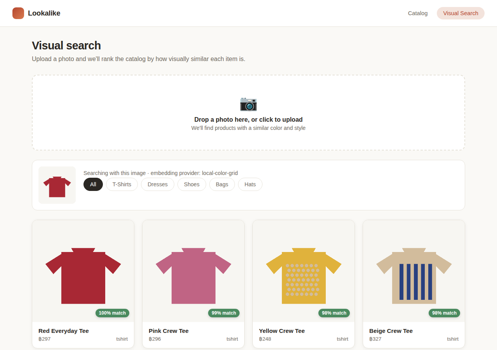

# Lookalike — Visual & Style Search

A demo e-commerce storefront where you search **by uploading a photo** instead of
typing keywords. Upload a picture of something you like and the app ranks the
product catalog by how visually similar each item is (color, silhouette, pattern).

Built as a portfolio/internship project to demonstrate a full-stack feature that
goes beyond CRUD: image ingestion, a pluggable AI embedding pipeline, vector
similarity search, and a polished React frontend to tie it together.



## Why this project

Traditional e-commerce search relies on the shopper knowing the right words
("crew neck", "midi dress"). Visual search removes that barrier — you just
show the app what you want. It's a small feature with an outsized amount to
learn from: image processing, embeddings/vector math, an external AI API
integration with graceful degradation, and a search UX that has to communicate
uncertainty (similarity scores) rather than exact matches.

## Architecture

```
frontend/  (React + Vite)
  |
  |  REST (JSON + multipart file upload)
  v
backend/   (Express)
  ├── /api/products        -> mock catalog (24 generated products)
  ├── /api/search           -> accepts an image, returns ranked matches
  └── embeddings service    -> Replicate CLIP API, or local fallback
        |
        v
  cosine similarity against pre-computed catalog embeddings
```

**Embedding provider (pluggable, "ready-made API" by design):**

- If `REPLICATE_API_TOKEN` is set in `backend/.env`, the backend calls
  [Replicate's hosted CLIP model](https://replicate.com/andreasjansson/clip-features)
  to turn images into real CLIP embeddings (semantic, not just color-based).
- If it's not set — or the API call fails for any reason (no network, rate
  limit, stale model version) — the backend automatically falls back to a
  **local color/shape embedding** (an 8×8 downsampled RGB grid). No external
  dependency, works completely offline, and is what powers the demo out of
  the box.
- Catalog embeddings are computed once and disk-cached
  (`backend/src/data/embeddings.cache.json`); the cache is invalidated
  automatically if the active provider changes, so query and catalog vectors
  are never compared across incompatible embedding spaces.

**Product images** are synthetically generated (`scripts/generate_mock_images.py`,
Pillow) rather than scraped, so there are no licensing concerns — the catalog
is 24 simple vector-style icons (t-shirts, dresses, shoes, bags, hats) across
varied colors and patterns.

## Getting started

Requires Node.js 18+ and Python 3 (only needed once, to (re)generate the mock
catalog images — already generated and committed under `backend/public/images`).

### 1. Backend

```bash
cd backend
npm install
cp .env.example .env   # leave REPLICATE_API_TOKEN blank to use the local fallback
npm start               # http://localhost:4000
```

Optional — regenerate the mock catalog:

```bash
python3 scripts/generate_mock_images.py   # run from the repo root
```

### 2. Frontend

In a second terminal:

```bash
cd frontend
npm install
cp .env.example .env    # points VITE_API_BASE_URL at the backend
npm run dev              # http://localhost:5173
```

Open `http://localhost:5173`, browse the catalog, or go to **Visual Search**
and drop in a photo.

### 3. (Optional) Enable real AI embeddings

1. Create a free [Replicate](https://replicate.com) account and generate an
   API token.
2. Put it in `backend/.env` as `REPLICATE_API_TOKEN`.
3. Restart the backend — startup logs print which embedding provider is
   active (`local-color-grid` or `replicate-clip`), and the catalog
   embeddings recompute automatically for the new provider.

## API reference

| Method | Route                         | Description                                      |
|--------|-------------------------------|---------------------------------------------------|
| GET    | `/api/health`                 | Liveness check + active embedding provider        |
| GET    | `/api/products?category=`     | List catalog, optional category filter            |
| GET    | `/api/products/:id`           | Single product                                     |
| POST   | `/api/search?category=&limit=`| Multipart `image` field → ranked similar products |

## Project structure

```
backend/
  src/
    index.js              Express app entry
    routes/products.js    Catalog endpoints
    routes/search.js      Image upload + search endpoint
    services/embeddings.js  Replicate call + local fallback
    services/similarity.js  Cosine similarity + ranking
    data/products.json    Generated mock catalog
    data/productStore.js  Loads catalog, computes/caches embeddings
  public/images/          Generated product images
frontend/
  src/
    pages/Home.jsx         Catalog grid + category filter
    pages/Search.jsx       Upload UI + ranked results
    pages/ProductDetail.jsx  Product page + "Find similar styles"
    components/            ProductCard, ImageUploader, CategoryFilter
    api/client.js          Fetch wrapper for the backend API
scripts/
  generate_mock_images.py  Synthetic product image/catalog generator
```

## Possible extensions

These are natural next steps if you want to keep building on this during
your internship and show progression over time:

- Swap the in-memory/JSON catalog for a real database (Postgres +
  [pgvector](https://github.com/pgvector/pgvector) for the similarity search
  itself, instead of doing cosine similarity in JS).
- Real product photography instead of generated icons, once there's a real
  catalog to point it at.
- Combine visual search with the text search / category filters already in
  the UI (hybrid search).
- User accounts + saved/liked items.
- Deploy: frontend to Vercel/Netlify, backend to Render/Railway/Fly.io.

## Tech stack

React 19, Vite, React Router · Node.js, Express, Multer, Sharp · Replicate
(CLIP) with a dependency-free local fallback · Python/Pillow for the mock
dataset generator.
